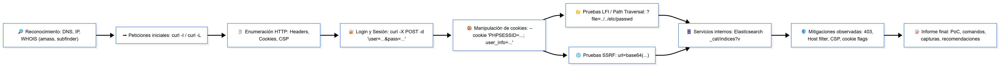

# Arsenal de un Analista: Uso Profesional de `curl`

Este proyecto técnico recoge el uso avanzado y realista de la herramienta `curl` en escenarios de análisis de vulnerabilidades web. Está orientado a analistas ofensivos, pentesters y profesionales que necesiten operar sin interfaces gráficas, integrando `curl` en sus flujos reales de análisis, automatización o scripting.

---

## Objetivo

- Documentar un uso avanzado y eficaz de `curl` en tareas de enumeración, explotación y validación de vulnerabilidades web.
- Construir una referencia técnica útil para analistas del equipo o para formar parte de un portfolio profesional.
- Integrar ejemplos reales con capturas, comandos usados, casos explotados y resultados observables.

---

## ¿Por qué `curl`?

`curl` es una herramienta crítica en análisis web, auditorías API y entornos donde no se puede depender de interfaces gráficas (Burp, Zap). Su versatilidad permite realizar desde pruebas de XSS o IDOR, hasta autenticaciones complejas, envío de cabeceras personalizadas, bypass de filtros o scripting automatizado.

Ventajas:
- Rápido, versátil y sin dependencias
- Ideal para scripting y automatización
- Funciona en entornos headless / remotos
- Permite total control de los headers, métodos, encoding y cuerpo

---
## Comparativa con otras herramientas

| Herramienta | Uso recomendado | Comentario |
|-------------|------------------|-----------|
| **curl**    | Scripting, automatización, pruebas rápidas | Ideal para pipelines y entornos headless |
| **Burp Suite** | Auditoría manual y explotación con proxy | Mejor para trabajo interactivo y repeater/intruder |
| **OWASP ZAP** | Escaneo automatizado y hooking | Buena alternativa OSS para pruebas automáticas |
| **httpie**  | CLI más legible para humanos | Útil para debugging humano, menos scriptable en pipelines complejos |

**Recomendación práctica:** Usar `curl` para **automación y PoC reproducible**, y Burp/ZAP para **auditoría interactiva y análisis profundo**.

---

## Limitaciones y contra-medidas

### Limitaciones de `curl`
- No es un proxy-interceptador: no dispone de Repeater/Intruder visuales.
- Requiere parsing manual de respuestas (usar `jq`, `grep`, `sed`).
- No detecta automáticamente patrones complejos (usar Nuclei, Burp, Dalfox).

### Recomendaciones de mitigación (para aplicaciones probadas)
- Validar y sanear input en servidor (evitar LFI/SSRF).  
- Implementar lista blanca en endpoints que consumen URLs externas.  
- Establecer flags `HttpOnly`, `Secure` y `SameSite` en cookies.  
- Habilitar CSP, X-Frame-Options y X-Content-Type-Options.  
- Registrar y monitorizar peticiones a endpoints sensibles (alertas por patrones sospechosos).

---
  
## Herramientas incluidas

| Categoría           | Funcionalidad                         |
|---------------------|----------------------------------------|
| Curl (core)         | Peticiones GET, POST, PUT, DELETE      |
| Headers             | Manipulación avanzada de headers       |
| Cookies             | Autenticación manual, sesiones         |
| Fuzzing manual      | Bash + wordlists para bruteforce       |
| Upload              | Envío de ficheros, validación de tipo  |
| Debug               | Ver respuesta completa y headers       |
| Token handling      | JWT, API tokens en Authorization       |

---

## Contenido de este repositorio

- [`cheatsheets/curl-cheatsheet-avanzado.md`](cheatsheets/curl-cheatsheet-avanzado.md):  
  Comandos reales, explicaciones, flags avanzados.

- [`ejemplos/casos-practicos-con-curl.md`](ejemplos/casos-practicos-con-curl.md):  
  Casos de XSS, IDOR, login, uploads inseguros, documentados con capturas y comandos.

- `img/`:  
  Evidencias gráficas de explotación real.

---

## Flujo de análisis profesional con `curl`

> Diagrama horizontal que muestra el pipeline de un análisis con `curl`: recolección, peticiones iniciales, enumeración HTTP, login y sesión, manipulación de cookies, pruebas LFI/SSRF, enumeración de servicios internos y reporte final.

---

## Conclusiones y recomendaciones

- `curl` es una herramienta esencial dentro del arsenal de un analista: **potente, scriptable y reproducible**.  
- En los casos prácticos del laboratorio se demostró su utilidad para **identificar LFI, SSRF, problemas de sesión y exposición de servicios internos**.  
- Para un análisis completo, combinar **curl (PoC / scripting)** con **Burp Suite / Nuclei / wfuzz** proporciona la mejor relación cobertura/eficiencia.

